# Music Playlist Recommender System

Here we have implemented a music recommender system using [Beeptunes](https://beeptunes.com/) (a large digital music store in Iran) dataset as the final project for [Rahnema College](https://rahnemacollege.com/)’s internship program.

## Roadmap
- Exploratory Data Analysis (EDA)
- Content-Based and Collaborative Filtering
- Hybrid Model
- API
- Example

# 1) Summary of EDA
Number of users: 586785  
Number of albums: 16780  
Number of tracks: 125029  
Number of artists: 16045  
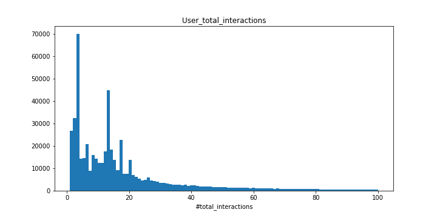 
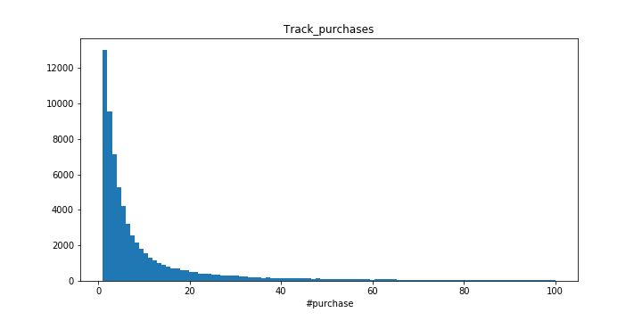 

# 2) Content-Based & Collaborative Filtering
- Recommends items with similar content to what the user has already rated positively  
- Beeptunes type key data for some of the tracks:  
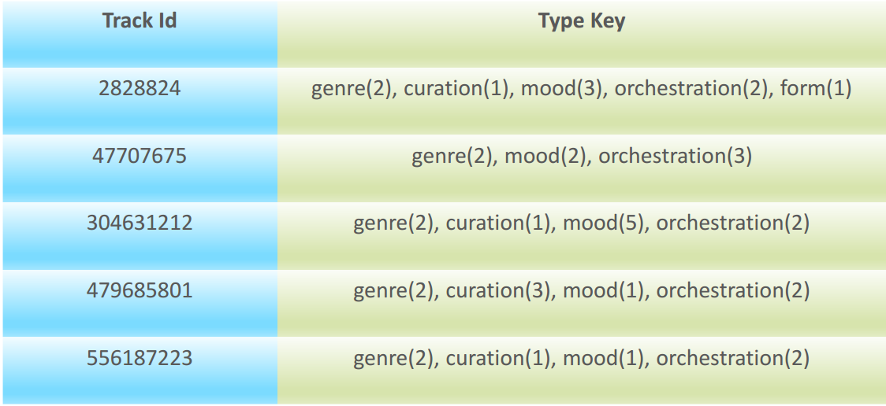 
- Computing Cosine Similarity for each type key independently :  
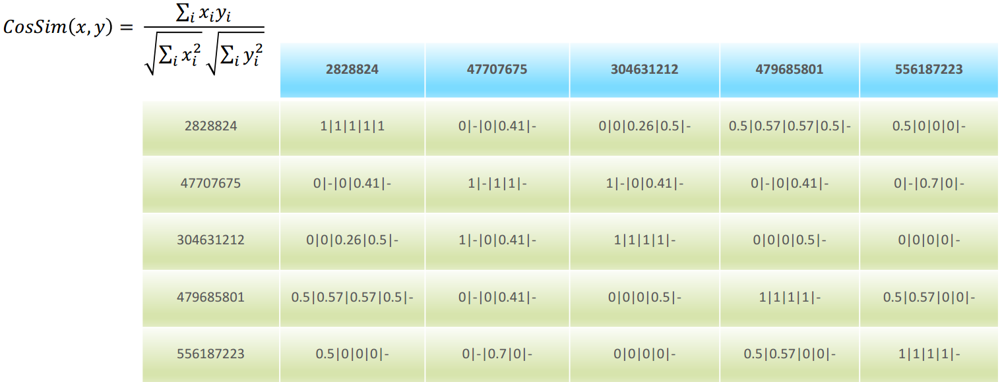

## Similarity Matrix:
- Give each type key a coefficient to compute the complete similarity matrix  

𝑆𝑖𝑚𝑖𝑙𝑎𝑟𝑖𝑡𝑦 = 𝑥 1 ∗ 𝑔𝑒𝑛𝑟𝑒𝑆𝑖𝑚𝑖𝑙𝑎𝑟𝑖𝑡𝑦 + 𝑥 2 ∗ 𝑜𝑟𝑐ℎ𝑒𝑠𝑡𝑟𝑎𝑡𝑖𝑜𝑛𝑆𝑖𝑚𝑖𝑙𝑎𝑟𝑖𝑡𝑦 𝑥 3
∗ 𝑐𝑢𝑟𝑎𝑡𝑖𝑜𝑛𝑆𝑖𝑚𝑖𝑙𝑎𝑟𝑖𝑡𝑦 + 𝑥 4 ∗ 𝑚𝑜𝑜𝑑𝑆𝑖𝑚𝑖𝑙𝑎𝑟𝑖𝑡𝑦 + 𝑥 5 ∗ 𝑓𝑜𝑟𝑚𝑆𝑖𝑚𝑖𝑙𝑎𝑟𝑖𝑡  

## Results:
- Calculating Similarity Matrix for all the data is computationally expensive
- Select 85 users with the most interactions (1000 tracks) 
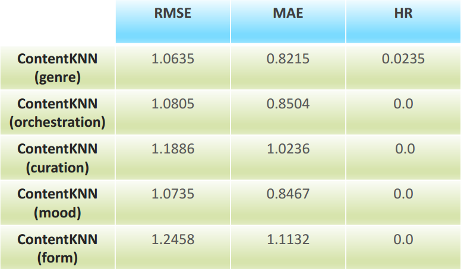

- Content-based:
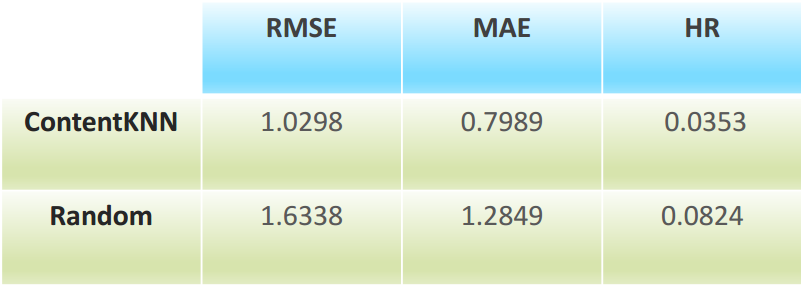

- Non-negative Matrix Factorization:
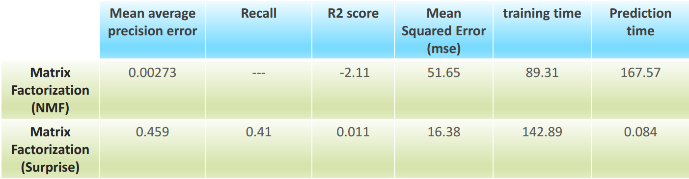

# 3) Hybrid Model
- Mix of recommender systems (Parallelized Hybrid)

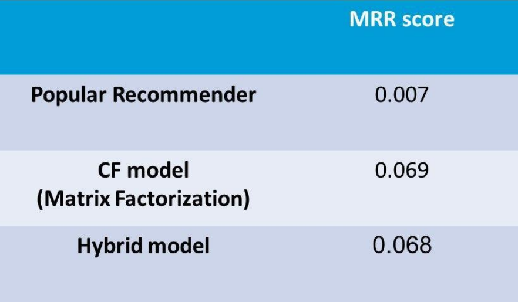

# 4) API
- Adding to database
	- Tracks
	- Download/likes/purchase for each track
	- Download/likes/purchase for each album
	- Likes for artists
- Reading from database
	- “Discovery” recommendation

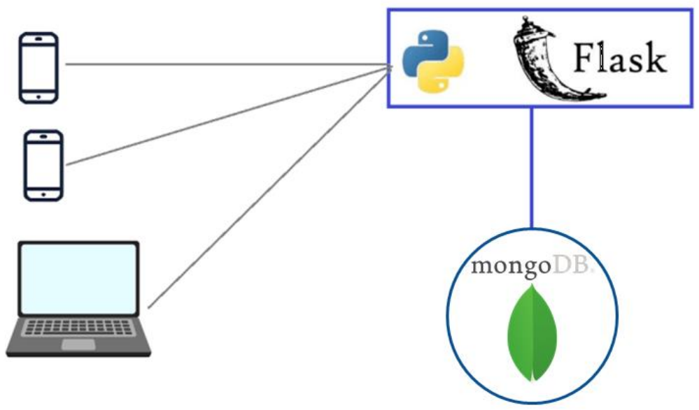

- Instructions
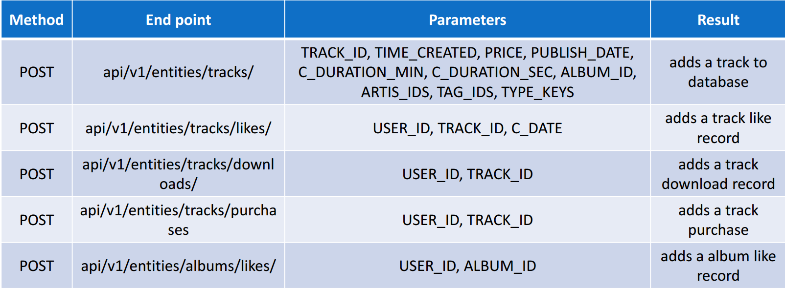
 
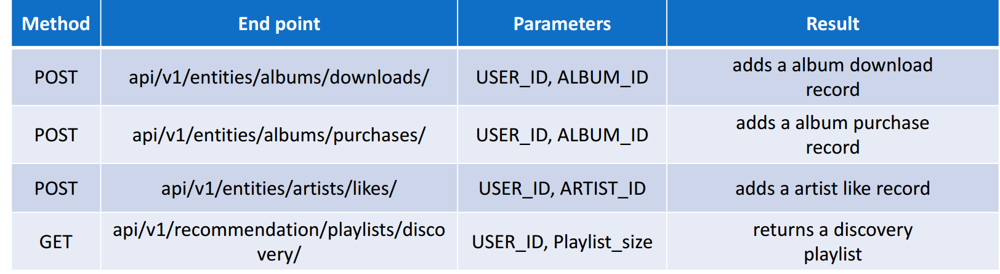
 
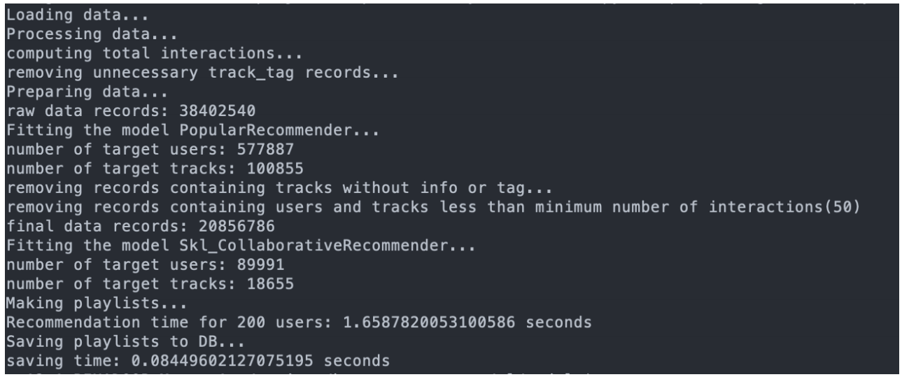
 
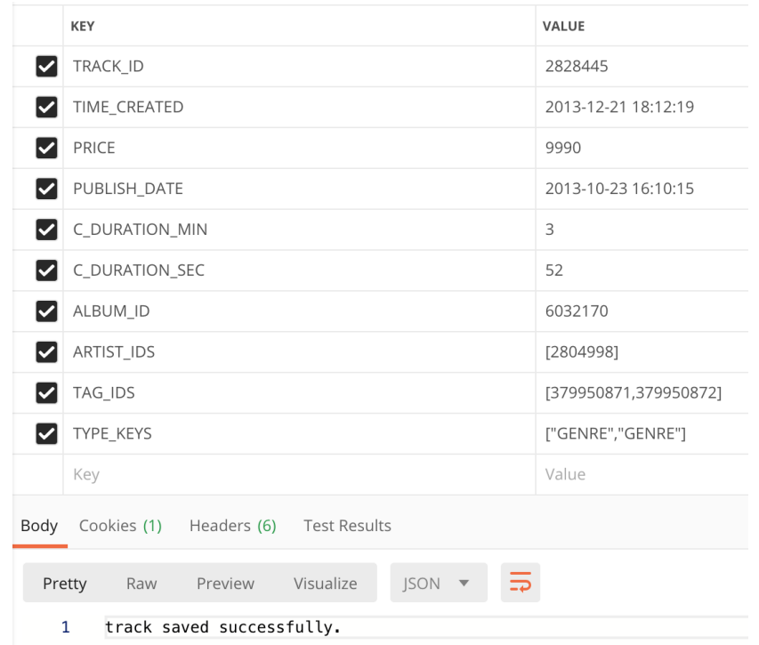

# 4) Example
- First one is the input track and the next three tracks are the top-3 recommendations:
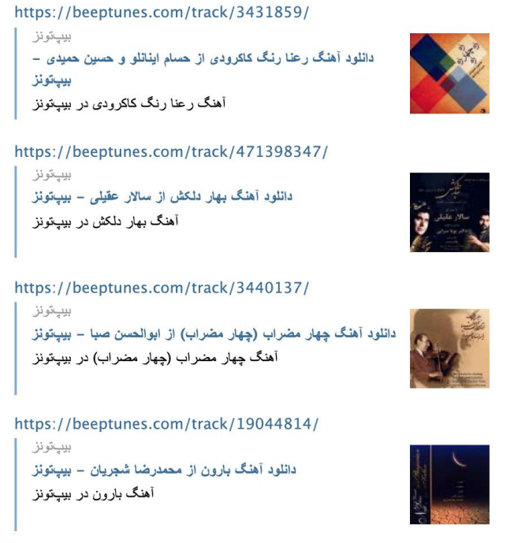

# 4) Group Members
[Mohamadreza Shariati](https://gitlab.com/Mrezashariati) 
[Farzaneh Rasti](https://gitlab.com/farzaneh_rst)  
[Maryam Valipour](https://github.com/maryam-v)  
[Behnam Vakili](https://gitlab.com/behnam.vr) 
